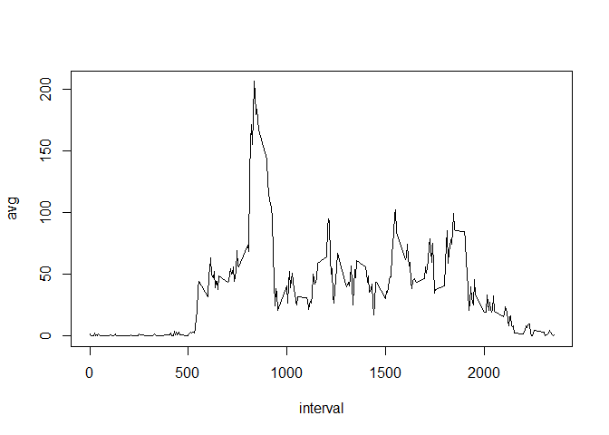

# Reproducible Research: Peer Assessment 1


## Loading and preprocessing the data

1. Download the file and unzip it.


```r
download.file("https://d396qusza40orc.cloudfront.net/repdata%2Fdata%2Factivity.zip",destfile=".\\repdataproj.zip")

for (i in dir(pattern="\\.zip$"))
{  unzip(i) }
```

2. Set working directory to the unzipped folder and read the CSV file. 

```r
setwd("repdata-data-activity")
adat<-read.csv("activity.csv")
```


3. Convert to date format

```r
adat$date<-as.Date(as.character(adat$date))
```

4. Load a required library

```r
library(plyr)
```

5. Save a copy of the original dataset. Remove all NAs for the first analysis.


```r
adat2<-adat
adat<-adat[!is.na(adat$steps),]
```

## What is mean total number of steps taken per day?

1. Use library plyr for summarizing data by date

```r
adatsum<-ddply(adat,~date,summarize,total=sum(steps))
```

2. Calculate mean and median number of steps per day


```r
meansteps <- mean(adatsum$total)
mediansteps <- median(adatsum$total)
```

The mean number of steps per day are 10766
The median number of steps per day are 10765

## What is the average daily activity pattern?

1. Calculate activity pattern by 5-min interval


```r
aintavg<-ddply(adat,~interval,summarize,avg=mean(steps))
```

2. Plot activity pattern by 5-min interval


```r
with(aintavg,plot(x=interval, y=avg, type='l'))
```

 

3. Find interval with max average number of steps

```r
maxstepinterval <- aintavg$interval[which.max(aintavg$avg)]
```

The mean number of steps per day are 835

## Imputing missing values

1. Count total number of NAs

```r
nacount<-sum(is.na(adat2))
```

2. Install some more required packages


```r
require("imputeR")
```

```
## Loading required package: imputeR
```

```r
require("ggplot2")
```

```
## Loading required package: ggplot2
```

3. Impute data using the lasso function

```r
impdata <- as.data.frame(impute(adat2, lmFun = "lassoR",cFun="lassoC")$imp)
```

```
## Imputation task is: Regression 
## iteration 1 using lassoR in progress...done!
## Difference after iteration 1 is 8.547569e-09 
## iteration 2 using lassoR in progress...done!
## Difference after iteration 2 is 5.419617e-12 
## iteration 3 using lassoR in progress...done!
## Difference after iteration 3 is 1.343136e-11
```

```r
adat2$steps <-impdata$steps
```

4. Recalculate mean and median with imputed data .Summarize data by date

```r
adatsum2<-ddply(adat2,~date,summarize,total=sum(steps))
```

5. Calculate mean and median number of steps per day

```r
meansteps2 <- mean(adatsum2$total)
mediansteps2 <- median(adatsum2$total)
```

Comparison of the parameters before and after imputing is shown in the following table.

Parameter |Before imputing | After imputing
------------|------------------|-----------
Mean steps |  10766 | 10766
Median steps |  10765 | 10766


6. Make a histogram

```r
hist(adatsum2$total)
```

 


## Are there differences in activity patterns between weekdays and weekends?

1. For this part the weekdays() function may be of some help here. Use the dataset with the filled-in missing values for this part.

```r
adat2$day <-weekdays(adat2$date)
```

2. Create a new factor variable in the dataset with two levels -- "weekday" and "weekend" indicating whether a given date is a weekday or weekend day.

```r
adat2$weekd[adat2$day %in% c("Saturday","Sunday")] <- "weekend"
adat2$weekd[!(adat2$day %in% c("Saturday","Sunday"))] <- "weekday"
adat2$weekd <-as.factor(adat2$weekd)
```

3. Make a panel plot containing a time series plot (i.e. type = "l") of the 5-minute interval (x-axis) and the average number of steps taken, averaged across all weekday days or weekend days (y-axis). The plot should look something like the following, which was created using simulated data.


```r
wkavg<-ddply(adat2,weekd~interval,summarize,avg=mean(steps))
qplot(x=interval,y=avg,data=wkavg,facets = weekd ~.,geom="line")
```

 

There are notable differences between weekday and weekend as seen from the plots above. 
