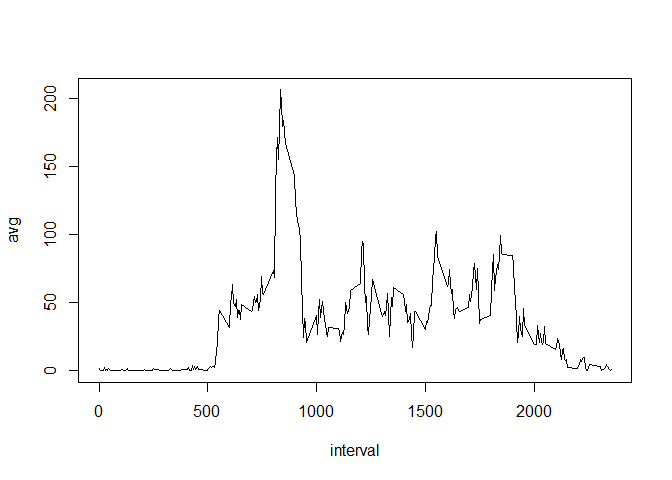
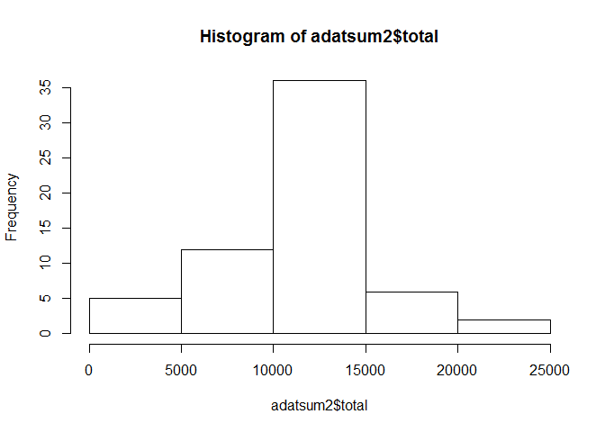
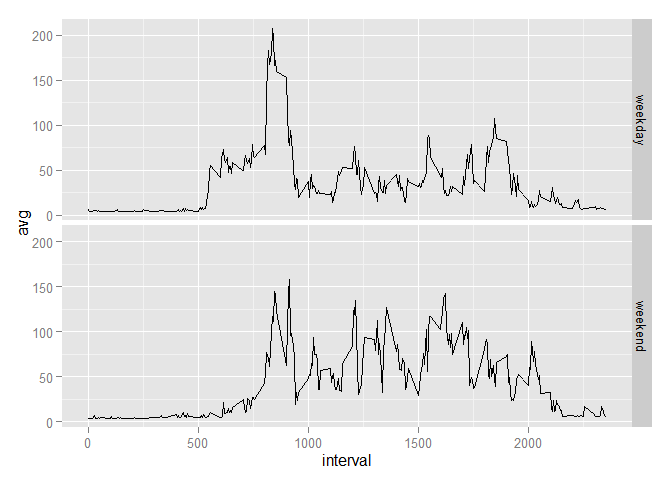

## Introduction

It is now possible to collect a large amount of data about personal
movement using activity monitoring devices such as a
[Fitbit](http://www.fitbit.com), [Nike
Fuelband](http://www.nike.com/us/en_us/c/nikeplus-fuelband), or
[Jawbone Up](https://jawbone.com/up). These type of devices are part of
the "quantified self" movement -- a group of enthusiasts who take
measurements about themselves regularly to improve their health, to
find patterns in their behavior, or because they are tech geeks. But
these data remain under-utilized both because the raw data are hard to
obtain and there is a lack of statistical methods and software for
processing and interpreting the data.

This assignment makes use of data from a personal activity monitoring
device. This device collects data at 5 minute intervals through out the
day. The data consists of two months of data from an anonymous
individual collected during the months of October and November, 2012
and include the number of steps taken in 5 minute intervals each day.

## Data

The data for this assignment can be downloaded from the course web
site:

* Dataset: [Activity monitoring data](https://d396qusza40orc.cloudfront.net/repdata%2Fdata%2Factivity.zip) [52K]

The variables included in this dataset are:

* **steps**: Number of steps taking in a 5-minute interval (missing
    values are coded as `NA`)

* **date**: The date on which the measurement was taken in YYYY-MM-DD
    format

* **interval**: Identifier for the 5-minute interval in which
    measurement was taken


The dataset is stored in a comma-separated-value (CSV) file and there
are a total of 17,568 observations in this
dataset.


## Assignment

This assignment will be described in multiple parts. You will need to
write a report that answers the questions detailed below. Ultimately,
you will need to complete the entire assignment in a **single R
markdown** document that can be processed by **knitr** and be
transformed into an HTML file.

Throughout your report make sure you always include the code that you
used to generate the output you present. When writing code chunks in
the R markdown document, always use `echo = TRUE` so that someone else
will be able to read the code. **This assignment will be evaluated via
peer assessment so it is essential that your peer evaluators be able
to review the code for your analysis**.

For the plotting aspects of this assignment, feel free to use any
plotting system in R (i.e., base, lattice, ggplot2)

Fork/clone the [GitHub repository created for this
assignment](http://github.com/rdpeng/RepData_PeerAssessment1). You
will submit this assignment by pushing your completed files into your
forked repository on GitHub. The assignment submission will consist of
the URL to your GitHub repository and the SHA-1 commit ID for your
repository state.

NOTE: The GitHub repository also contains the dataset for the
assignment so you do not have to download the data separately.


# Reproducible Research: Peer Assessment 1


## Loading and preprocessing the data

1. Download the file and unzip it.


```r
download.file("https://d396qusza40orc.cloudfront.net/repdata%2Fdata%2Factivity.zip",destfile=".\\repdataproj.zip")

for (i in dir(pattern="\\.zip$"))
{  unzip(i) }
```

2. Read the CSV file. 

```r
#setwd("repdata-data-activity")
adat<-read.csv("activity.csv")
```


3. Convert to date format

```r
adat$date<-as.Date(as.character(adat$date))
```

4. Load a required library

```r
library(plyr)
```

5. Save a copy of the original dataset. Remove all NAs for the first analysis.


```r
adat2<-adat
adat<-adat[!is.na(adat$steps),]
```

## What is mean total number of steps taken per day?

1. Use library plyr for summarizing data by date

```r
adatsum<-ddply(adat,~date,summarize,total=sum(steps))
```

2. Calculate mean and median number of steps per day


```r
meansteps <- mean(adatsum$total)
mediansteps <- median(adatsum$total)
```

The mean number of steps per day are 10766
The median number of steps per day are 10765

## What is the average daily activity pattern?

1. Calculate activity pattern by 5-min interval


```r
aintavg<-ddply(adat,~interval,summarize,avg=mean(steps))
```

2. Plot activity pattern by 5-min interval


```r
with(aintavg,plot(x=interval, y=avg, type='l'))
```

 

3. Find interval with max average number of steps

```r
maxstepinterval <- aintavg$interval[which.max(aintavg$avg)]
```

The mean number of steps per day are 835

## Imputing missing values

1. Count total number of NAs

```r
nacount<-sum(is.na(adat2))
```

2. Install some more required packages for imputation.


```r
require("imputeR")
```

```
## Loading required package: imputeR
```

```r
require("ggplot2")
```

```
## Loading required package: ggplot2
```

3. Impute data using the lasso function (this is my imputation strategy)

```r
impdata <- as.data.frame(impute(adat2, lmFun = "lassoR",cFun="lassoC")$imp)
```

```
## Imputation task is: Regression 
## iteration 1 using lassoR in progress...done!
## Difference after iteration 1 is 9.176178e-09 
## iteration 2 using lassoR in progress...done!
## Difference after iteration 2 is 2.186664e-11 
## iteration 3 using lassoR in progress...done!
## Difference after iteration 3 is 1.343136e-11 
## iteration 4 using lassoR in progress...done!
## Difference after iteration 4 is 4.545955e-11
```

```r
adat2$steps <-impdata$steps
```

4. Recalculate mean and median with imputed data .Summarize data by date

```r
adatsum2<-ddply(adat2,~date,summarize,total=sum(steps))
```

5. Calculate mean and median number of steps per day

```r
meansteps2 <- mean(adatsum2$total)
mediansteps2 <- median(adatsum2$total)
```

Comparison of the parameters before and after imputing is shown in the following table.

Parameter |Before imputing | After imputing
------------|------------------|-----------
Mean steps |  10766 | 10766
Median steps |  10765 | 10766


6. Make a histogram

```r
hist(adatsum2$total)
```

 


## Are there differences in activity patterns between weekdays and weekends?

1. For this part the weekdays() function may be of some help here. Use the dataset with the filled-in missing values for this part.

```r
adat2$day <-weekdays(adat2$date)
```

2. Create a new factor variable in the dataset with two levels -- "weekday" and "weekend" indicating whether a given date is a weekday or weekend day.

```r
adat2$weekd[adat2$day %in% c("Saturday","Sunday")] <- "weekend"
adat2$weekd[!(adat2$day %in% c("Saturday","Sunday"))] <- "weekday"
adat2$weekd <-as.factor(adat2$weekd)
```

3. Make a panel plot containing a time series plot (i.e. type = "l") of the 5-minute interval (x-axis) and the average number of steps taken, averaged across all weekday days or weekend days (y-axis). The plot should look something like the following, which was created using simulated data.


```r
wkavg<-ddply(adat2,weekd~interval,summarize,avg=mean(steps))
qplot(x=interval,y=avg,data=wkavg,facets = weekd ~.,geom="line")
```

 

There are notable differences between weekday and weekend as seen from the plots above. 
